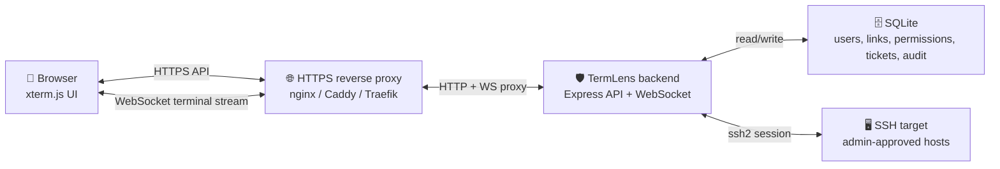
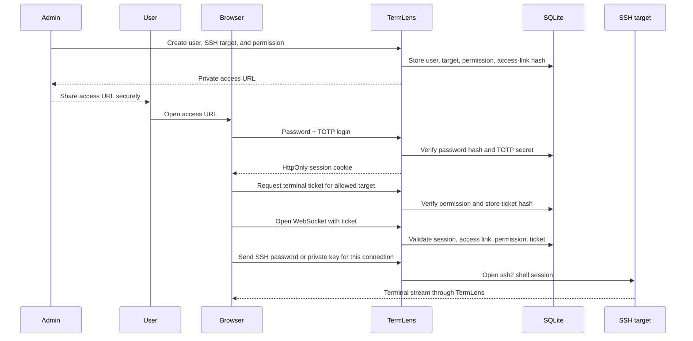

# TermLens

[中文说明](README.zh-CN.md) | [Roadmap](ROADMAP.md) | [Changelog](CHANGELOG.md) | [Security](SECURITY.md)


TermLens is a security-focused WebSSH gateway for teams that need browser-based SSH access with explicit user, target, and permission control.

It provides a browser terminal, an admin console, user-specific random access links, SSH target permissions, short-lived terminal tickets, and mandatory password + TOTP two-factor authentication. The terminal UI is powered by xterm.js, and the backend opens SSH sessions through Node.js `ssh2`.

## 🧭 Design Philosophy

TermLens is designed around a few practical principles:

- 🔐 **Security before convenience**: every terminal session must pass login, TOTP, access-link, target-permission, and terminal-ticket checks.
- 🎯 **Explicit access boundaries**: users do not browse arbitrary hosts; admins define SSH targets and grant per-user permissions.
- 🧩 **Small backend, clear responsibilities**: the backend only handles authentication, authorization, ticketing, WebSocket forwarding, and SSH session creation.
- 🕶️ **No credential persistence**: SSH passwords and private keys entered in the browser are used for the current connection only.
- 🧹 **No terminal-output persistence**: terminal output is streamed to the browser and is not stored by the application.
- 🖥️ **Terminal-first interface**: the connection panel can collapse, the terminal panel can resize, and fullscreen mode keeps focus on the shell.

## ✨ Features

- 🖥️ Browser-based SSH terminal powered by xterm.js.
- 📐 Collapsible connection panel, resizable terminal layout, native fullscreen, and Safari-friendly immersive fullscreen fallback.
- 📱 RustDesk-style mobile helper toolbar with one-shot modifiers, platform-aware `Cmd`/`Win` labels, reorderable/hidden keys, function keys, navigation keys, shell symbols, and soft-keyboard-aware sizing.
- ✍️ Mobile Vim helpers for insert mode, command mode, save-and-quit, and force-quit actions.
- 📝 Side text input panel for sending prepared text into the current terminal cursor position.
- 👥 Admin-managed users, roles, SSH targets, and per-target permissions.
- 📋 Admin access-link actions for copying or copying-and-opening generated links.
- 🔗 Random per-user access links before login and terminal launch.
- 🔑 Mandatory password + TOTP authentication with QR-code enrollment.
- 🎟️ Short-lived one-time terminal tickets before WebSocket connection.
- 🛡️ Session, access-link, target-permission, and ticket checks before terminal input is forwarded to SSH.
- 🚫 Remote SSH passwords and private keys are used only for the current connection and are not stored.
- 📵 No application telemetry and no terminal-output persistence.
- 🛰️ Optional private endpoint relay for computers without public IP addresses, implemented as an opt-in module with a local outbound Agent.

## 🏗️ System Architecture

Real WebSSH cannot be implemented as a normal pure-browser application because browsers cannot open arbitrary TCP connections to SSH servers or spawn a local shell. TermLens therefore uses a backend SSH gateway.



### Component Responsibilities

| Component | Responsibility |
| --- | --- |
| 🧑 Browser UI | Login, TOTP setup, target selection, SSH credential input, terminal rendering, resize/fullscreen controls. |
| 🌐 Reverse proxy | HTTPS termination, WebSocket upgrade forwarding, optional IP allowlist or extra proxy authentication. |
| 🛡️ TermLens backend | API routing, session cookies, access links, TOTP validation, permission checks, terminal tickets, WebSocket-to-SSH forwarding. |
| 🗄️ SQLite database | Users, password hashes, encrypted TOTP secrets, SSH targets, permissions, access-link hashes, session hashes, ticket hashes, audit events. |
| 🖥️ SSH target | The actual remote host. Command-level permissions must be enforced on this host. |

## 🔄 Interaction Model

TermLens separates access into several short, explicit steps. This makes the user flow slightly more controlled, but it keeps the security boundary easier to reason about.



### User Interface Flow

```text
🔗 Access URL
  -> 🔑 Password login
  -> 📱 TOTP setup or verification
  -> 🖥️ Authorized target list
  -> 🎟️ Terminal ticket
  -> ⌨️ SSH credential prompt
  -> 🧑‍💻 Browser terminal session
```

The terminal page has three main areas:

- 🧾 **Connection panel**: target summary, SSH auth method, password/private-key fields, collapse control.
- ⌨️ **Terminal panel**: xterm.js terminal, fit button, resize-aware layout, native fullscreen, and immersive fullscreen fallback for mobile Safari.
- 📱 **Mobile helper toolbar**: RustDesk-style one-shot modifiers, platform-aware `Cmd`/`Win` labels, configurable order/visibility, common `Ctrl` shortcuts, `F1`-`F12`, navigation keys, and shell symbols.
- 📝 **Text input panel**: collapsible side panel for preparing text and sending it into the current terminal cursor position. On mobile, side panels collapse automatically after terminal connection to keep the shell visible.

## 🛡️ Security Model

TermLens exposes SSH terminal access. Treat every deployment as a high-risk administrative surface.

TermLens checks the login session, access link, target permission, and terminal ticket before SSH input is forwarded. It does not attempt to authorize every remote shell command after the user has entered the remote host. Command-level restrictions must be implemented on the remote host with Linux permissions, restricted shells, sudo policy, a bastion host, or an audit system.

Important defaults:

- 🔗 Access links and terminal tickets are random and stored only as hashes.
- 🍪 Session cookies are `HttpOnly` and `SameSite=Strict`; set `TERMLENS_COOKIE_SECURE=true` for HTTPS.
- 🔐 TOTP secrets are encrypted at rest with `TERMLENS_SECRET_KEY`.
- 🕶️ SSH credentials entered in the browser are forwarded only for the current connection.
- 🚫 Terminal output, SSH passwords, private keys, and raw tokens should never be logged.

Read [SECURITY.md](SECURITY.md) before exposing TermLens outside a private development environment.

## 🧰 Requirements

- Node.js 24 or newer.
- npm.
- A reverse proxy such as nginx, Caddy, or Traefik for production HTTPS deployments.
- One or more SSH targets reachable from the TermLens backend.

TermLens uses Node's built-in SQLite support, which is why Node.js 24+ is required.

## 🚀 Quick Start

Install dependencies and build the frontend:

```bash
npm install
npm run build
```

Create local configuration:

```bash
cp .env.example .env
editor .env
```

Generate a secret key:

```bash
openssl rand -base64 48
```

Set the generated value as `TERMLENS_SECRET_KEY`, then start the server:

```bash
npm start
```

Create the first admin account:

```bash
npm run init-admin
```

The command prints a one-time admin password and a private access URL. Treat both as secrets. Open the access URL, enter the generated password, scan the TOTP QR code, and finish login.

## ⚙️ Configuration

See [.env.example](.env.example) for all supported environment variables.

| Variable | Purpose |
| --- | --- |
| `TERMLENS_HOST` | Backend bind address, usually `127.0.0.1` behind a reverse proxy. |
| `TERMLENS_PORT` | Backend port. |
| `TERMLENS_BASE_PATH` | Public mount path, default `/project/termlens/`. |
| `TERMLENS_PUBLIC_URL` | Absolute public URL used when generating access links. |
| `TERMLENS_DATA_DIR` | Directory for local SQLite data. |
| `TERMLENS_DB_PATH` | SQLite database path. |
| `TERMLENS_COOKIE_SECURE` | Set to `true` when served over HTTPS. |
| `TERMLENS_SESSION_TTL_SECONDS` | Browser login session lifetime. |
| `TERMLENS_TICKET_TTL_SECONDS` | Terminal ticket lifetime. |
| `TERMLENS_SECRET_KEY` | Required encryption key for sensitive values. |
| `TERMLENS_PRIVATE_RELAY_ENABLED` | Enables the optional private endpoint relay module. Defaults to `false`. |
| `TERMLENS_PRIVATE_RELAY_ALLOW_NON_LOOPBACK` | Allows private Agents to forward non-loopback local hosts. Defaults to `false`. |
| `TERMLENS_PRIVATE_RELAY_ENROLLMENT_TTL_SECONDS` | Lifetime for one-time Agent enrollment tokens. |
| `TERMLENS_PRIVATE_RELAY_MAX_STREAMS_PER_AGENT` | Concurrent SSH tunnel stream limit per Agent. |

Paths shown in `.env.example`, `systemd/`, and `nginx/` are generic deployment examples. Replace them with paths that match your own environment.

## 🛰️ Optional Private Endpoint Relay

The private endpoint relay is disabled unless `TERMLENS_PRIVATE_RELAY_ENABLED=true` is set. When enabled, admins can create private endpoints, generate one-time Agent enrollment commands, and grant endpoint permissions to users.

The Agent runs on the private laptop or desktop and opens an outbound WebSocket to TermLens. Browser users still go through the normal access-link, password, TOTP, permission, and terminal-ticket flow. TermLens then opens SSH over the Agent tunnel to the Agent's local SSH service.

Agent setup flow:

1. Enable the module on the TermLens backend.
2. Create a private endpoint in the admin console.
3. Copy the generated Agent enrollment command.
4. Run the command from a TermLens checkout on the private computer after installing dependencies.
5. Start the Agent with `npm run private-agent -- run`.
6. Grant users permission to the private endpoint.

Security defaults:

- Enrollment tokens are one-time and short-lived.
- Agent tokens are stored only on the private computer, sent through the WebSocket `Authorization` header, and only hashes are stored by TermLens.
- The Agent forwards `127.0.0.1:22`-style loopback SSH by default.
- Non-loopback forwarding requires explicit opt-in on both backend and Agent.
- The module is isolated behind a feature flag and can be omitted from deployment workflows.

## 📦 Production Deployment

Use the examples in `systemd/` and `nginx/` as templates.

### 1. Prepare a Service User

```bash
sudo useradd --system --home /nonexistent --shell /usr/sbin/nologin termlens
```

### 2. Install and Build

```bash
npm ci
npm run build
```

### 3. Create Production Configuration

```bash
sudo mkdir -p /etc/termlens /var/lib/termlens
sudo chown termlens:termlens /var/lib/termlens
sudo cp .env.example /etc/termlens/termlens.env
sudo editor /etc/termlens/termlens.env
```

Set at least:

```bash
NODE_ENV=production
TERMLENS_HOST=127.0.0.1
TERMLENS_PORT=7682
TERMLENS_COOKIE_SECURE=true
# Generate with: openssl rand -base64 48
TERMLENS_SECRET_KEY=
```

### 4. Configure systemd

Use [systemd/termlens.service.example](systemd/termlens.service.example) as a starting point, then adapt paths, user names, and Node.js location to your server.

```bash
sudo systemctl daemon-reload
sudo systemctl enable --now termlens.service
sudo systemctl status termlens.service
```

### 5. Configure Reverse Proxy

Use [nginx/termlens.nginx.example](nginx/termlens.nginx.example) as a starting point. The reverse proxy must forward both normal HTTP requests and WebSocket upgrades.

Recommended production posture:

- 🔒 Terminate TLS at the reverse proxy.
- 🧱 Bind TermLens to `127.0.0.1`, not a public interface.
- 🌐 Add VPN, IP allowlist, or proxy auth when possible.
- ⏱️ Keep terminal tickets long enough for SSH credential entry; the default is 10 minutes.
- 🔁 Rotate access links when users leave or links may have been exposed.

### 6. Bootstrap Admin

```bash
npm run init-admin
```

Store the generated password and access URL securely. Rotate the password and access link after initial setup when appropriate.

## 👤 Usage Guide

### Admin Flow

1. 🔐 Open the private admin access URL and complete password + TOTP login.
2. 👥 Create users with strong initial passwords.
3. 🖥️ Add SSH targets with host, port, and SSH username.
4. ✅ Grant each user only the SSH targets they need.
5. 🔗 Generate and share each user's private access URL through a secure channel.
6. 🧯 Disable users, reset TOTP, or rotate access links when needed.

### User Flow

1. 🔗 Open the private access URL from the administrator.
2. 🔑 Log in with password and TOTP. First login may require scanning a QR code.
3. 🖥️ Choose an authorized SSH target.
4. ⌨️ Enter SSH password or private key for the current connection.
5. 📱 On mobile, choose the key profile and arrange or hide helper keys as needed.
6. 📝 Use the text input panel to send prepared text to the current terminal cursor position.
7. 📐 Collapse the connection panel, resize the terminal, or enter fullscreen mode as needed.
8. 🚪 Close the terminal and log out when finished.

## 🚧 Limitations

- TermLens is not a remote command sandbox.
- TermLens does not provide session recording.
- TermLens does not replace SSH host hardening, sudo policy, or host-level auditing.
- Public internet exposure should be treated carefully and reviewed against your organization's security requirements.

## 🧪 Development

Run tests:

```bash
npm test
```

Build:

```bash
npm run build
```

Run dependency audit for production dependencies:

```bash
npm audit --omit=dev
```

## 📄 License

TermLens is released under the MIT License. Third-party dependencies are distributed under their respective licenses.
