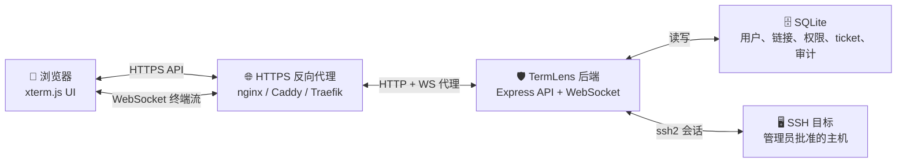
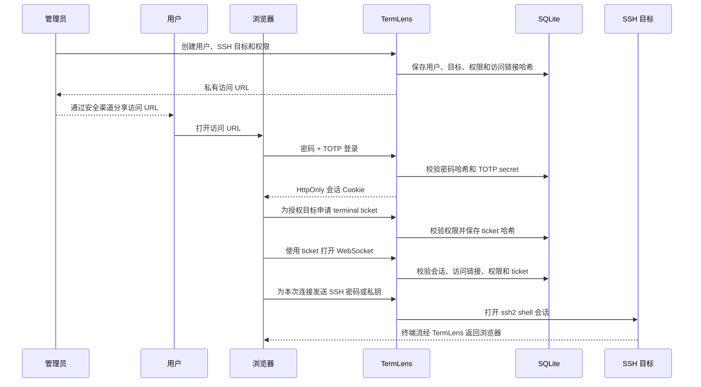

# TermLens

[English README](README.md) | [路线图](ROADMAP.zh-CN.md) | [更新日志](CHANGELOG.zh-CN.md) | [安全说明](SECURITY.md)


TermLens 是一个安全优先的 WebSSH 网关，适合需要在浏览器里使用 SSH，同时又需要明确控制用户、目标主机和权限的场景。

它提供浏览器终端、管理后台、用户专属随机访问链接、SSH 目标权限、短期 terminal ticket，以及强制密码 + TOTP 双因子验证。终端 UI 基于 xterm.js，后端通过 Node.js `ssh2` 建立 SSH 会话。

## 🧭 设计理念

TermLens 围绕几个务实原则设计：

- 🔐 **安全优先于便利**：每个终端会话都必须经过登录、TOTP、访问链接、目标权限和 terminal ticket 校验。
- 🎯 **明确访问边界**：用户不能随意填写任意主机；管理员定义 SSH 目标，并按用户授权。
- 🧩 **小后端、职责清晰**：后端只负责认证、授权、ticket、WebSocket 转发和 SSH 会话创建。
- 🕶️ **不持久化 SSH 凭据**：浏览器里输入的 SSH 密码和私钥只用于当前连接。
- 🧹 **不持久化终端输出**：终端输出只流式传给浏览器，应用不落盘保存。
- 🖥️ **终端优先的界面**：连接面板可折叠，终端面板可调整大小，全屏模式让用户专注在 shell 上。

## ✨ 功能

- 🖥️ 基于 xterm.js 的浏览器 SSH 终端。
- 📐 左侧连接面板可折叠，终端布局可拖拽调整，支持原生全屏和适配 Safari 的沉浸式全屏 fallback。
- 📱 移动端终端辅助按键栏，提供终端常用按键和软键盘遮挡优化。
- 👥 管理后台可管理用户、角色、SSH 目标和目标权限。
- 📋 管理后台生成访问链接后支持复制和复制并打开。
- 🔗 用户必须通过专属随机访问链接进入登录流程。
- 🔑 强制密码 + TOTP 双因子验证，首次登录通过二维码设置 TOTP。
- 🎟️ 打开终端前必须获取短期一次性 terminal ticket。
- 🛡️ 终端输入转发到 SSH 前会检查登录会话、访问链接、目标权限和 ticket。
- 🚫 远程 SSH 密码和私钥只在当前连接中使用，不写入数据库。
- 📵 不内置统计上报，也不持久化终端输出。
- 🛰️ 没有公网 IP 的私有电脑中继访问能力已在 [路线图](ROADMAP.zh-CN.md) 中规划。

## 🏗️ 系统架构

真实 WebSSH 不能按普通纯浏览器应用实现，因为浏览器不能直接打开任意 SSH TCP 连接，也不能启动本机 shell。TermLens 因此采用后端 SSH 网关。



### 组件职责

| 组件 | 职责 |
| --- | --- |
| 🧑 浏览器 UI | 登录、TOTP 设置、目标选择、SSH 凭据输入、终端渲染、尺寸调整和全屏控制。 |
| 🌐 反向代理 | HTTPS 终止、WebSocket upgrade 转发、可选 IP 白名单或额外代理鉴权。 |
| 🛡️ TermLens 后端 | API 路由、会话 Cookie、访问链接、TOTP 校验、权限校验、terminal ticket、WebSocket 到 SSH 的转发。 |
| 🗄️ SQLite 数据库 | 用户、密码哈希、加密 TOTP secret、SSH 目标、权限、访问链接哈希、会话哈希、ticket 哈希和审计事件。 |
| 🖥️ SSH 目标 | 实际远程主机。命令级权限必须在远程主机上控制。 |

## 🔄 交互原理

TermLens 把访问过程拆成多个短而明确的步骤。这样用户路径会更受控，但安全边界更容易理解和审计。



### 用户界面流程

```text
🔗 访问 URL
  -> 🔑 密码登录
  -> 📱 TOTP 设置或验证
  -> 🖥️ 授权目标列表
  -> 🎟️ terminal ticket
  -> ⌨️ SSH 凭据输入
  -> 🧑‍💻 浏览器终端会话
```

终端页面有两个核心区域：

- 🧾 **连接面板**：目标信息、SSH 认证方式、密码/私钥字段、折叠控制。
- ⌨️ **终端面板**：xterm.js 终端、适配按钮、可响应尺寸变化的布局、原生全屏和移动 Safari 沉浸式全屏 fallback。
- 📱 **移动端辅助按键栏**：提供手机键盘经常隐藏或缺失的终端常用按键。

## 🛡️ 安全模型

TermLens 暴露的是 SSH 终端访问能力。任何部署都应该被视为高风险管理入口。

TermLens 会在 SSH 输入转发前检查登录会话、访问链接、目标权限和 terminal ticket。进入远程主机 shell 后，单条远程命令级别的限制不能只依赖 WebTerminal 实现，必须通过远程主机权限、受限 shell、sudo 策略、堡垒机或审计系统控制。

重要默认行为：

- 🔗 访问链接和 terminal ticket 是随机值，并且只以哈希形式存储。
- 🍪 会话 Cookie 使用 `HttpOnly` 和 `SameSite=Strict`；HTTPS 部署应设置 `TERMLENS_COOKIE_SECURE=true`。
- 🔐 TOTP secret 使用 `TERMLENS_SECRET_KEY` 加密后落盘。
- 🕶️ 浏览器里输入的 SSH 凭据只用于当前连接。
- 🚫 不应该记录终端输出、SSH 密码、私钥或原始 token。

对外暴露服务前请先阅读 [SECURITY.md](SECURITY.md)。

## 🧰 运行要求

- Node.js 24 或更新版本。
- npm。
- 生产部署建议使用 nginx、Caddy 或 Traefik 等反向代理提供 HTTPS。
- TermLens 后端需要能访问一个或多个 SSH 目标。

TermLens 使用 Node 内置 SQLite 能力，所以要求 Node.js 24+。

## 🚀 快速开始

安装依赖并构建前端：

```bash
npm install
npm run build
```

创建本地配置：

```bash
cp .env.example .env
editor .env
```

生成密钥：

```bash
openssl rand -base64 48
```

把生成的值写入 `TERMLENS_SECRET_KEY`，然后启动服务：

```bash
npm start
```

创建第一个管理员账号：

```bash
npm run init-admin
```

该命令会输出一次性管理员密码和私有访问 URL。请把两者都当作敏感信息处理。打开访问 URL，输入生成的密码，扫描 TOTP 二维码，并完成登录。

## ⚙️ 配置

所有支持的环境变量见 [.env.example](.env.example)。

| 变量 | 用途 |
| --- | --- |
| `TERMLENS_HOST` | 后端监听地址，反向代理后通常使用 `127.0.0.1`。 |
| `TERMLENS_PORT` | 后端端口。 |
| `TERMLENS_BASE_PATH` | 公开挂载路径，默认 `/project/termlens/`。 |
| `TERMLENS_PUBLIC_URL` | 生成访问链接时使用的公网 URL。 |
| `TERMLENS_DATA_DIR` | 本地 SQLite 数据目录。 |
| `TERMLENS_DB_PATH` | SQLite 数据库路径。 |
| `TERMLENS_COOKIE_SECURE` | HTTPS 部署时设置为 `true`。 |
| `TERMLENS_SESSION_TTL_SECONDS` | 浏览器登录会话有效期。 |
| `TERMLENS_TICKET_TTL_SECONDS` | terminal ticket 有效期。 |
| `TERMLENS_SECRET_KEY` | 敏感信息加密密钥，必填。 |

`.env.example`、`systemd/` 和 `nginx/` 中出现的路径都是通用部署示例，请按自己的环境替换。

## 📦 生产部署

`systemd/` 和 `nginx/` 目录里的文件是模板。

### 1. 准备服务用户

```bash
sudo useradd --system --home /nonexistent --shell /usr/sbin/nologin termlens
```

### 2. 安装并构建

```bash
npm ci
npm run build
```

### 3. 创建生产配置

```bash
sudo mkdir -p /etc/termlens /var/lib/termlens
sudo chown termlens:termlens /var/lib/termlens
sudo cp .env.example /etc/termlens/termlens.env
sudo editor /etc/termlens/termlens.env
```

至少设置：

```bash
NODE_ENV=production
TERMLENS_HOST=127.0.0.1
TERMLENS_PORT=7682
TERMLENS_COOKIE_SECURE=true
# Generate with: openssl rand -base64 48
TERMLENS_SECRET_KEY=
```

### 4. 配置 systemd

以 [systemd/termlens.service.example](systemd/termlens.service.example) 为起点，然后按自己的服务器调整路径、用户和 Node.js 位置。

```bash
sudo systemctl daemon-reload
sudo systemctl enable --now termlens.service
sudo systemctl status termlens.service
```

### 5. 配置反向代理

以 [nginx/termlens.nginx.example](nginx/termlens.nginx.example) 为起点。反向代理必须同时转发普通 HTTP 请求和 WebSocket upgrade。

推荐生产姿态：

- 🔒 在反向代理层终止 TLS。
- 🧱 TermLens 只绑定 `127.0.0.1`，不要直接暴露公开网卡。
- 🌐 条件允许时增加 VPN、IP 白名单或代理鉴权。
- ⏱️ terminal ticket 需要给用户输入 SSH 凭据留出合理时间，默认有效期为 10 分钟。
- 🔁 用户离开或链接可能泄露时，及时轮换访问链接。

### 6. 初始化管理员

```bash
npm run init-admin
```

妥善保存生成的密码和访问 URL。完成初始化后，可按需轮换密码和访问链接。

## 👤 使用说明

### 管理员流程

1. 🔐 打开私有管理员访问 URL，并完成密码 + TOTP 登录。
2. 👥 创建用户并设置强初始密码。
3. 🖥️ 添加 SSH 目标，填写 host、端口和 SSH 用户。
4. ✅ 只给每个用户授予必要的 SSH 目标权限。
5. 🔗 生成用户专属访问 URL，并通过安全渠道发送给用户。
6. 🧯 在需要时禁用用户、重置 TOTP 或轮换访问链接。

### 用户流程

1. 🔗 打开管理员提供的私有访问 URL。
2. 🔑 使用密码和 TOTP 登录。首次登录可能需要扫描二维码。
3. 🖥️ 选择已授权的 SSH 目标。
4. ⌨️ 为当前连接输入 SSH 密码或私钥。
5. 📐 按需折叠连接面板、调整终端宽度或进入全屏模式。
6. 🚪 使用完成后关闭终端并退出登录。

## 🚧 限制

- TermLens 不是远程命令沙箱。
- TermLens 不提供会话录屏。
- TermLens 不能替代 SSH 主机加固、sudo 策略或主机侧审计。
- 暴露到公网前，应按组织安全要求仔细评估。

## 🧪 开发

运行测试：

```bash
npm test
```

构建：

```bash
npm run build
```

检查生产依赖：

```bash
npm audit --omit=dev
```

## 📄 许可

TermLens 使用 MIT License。第三方依赖遵循各自的许可证。
