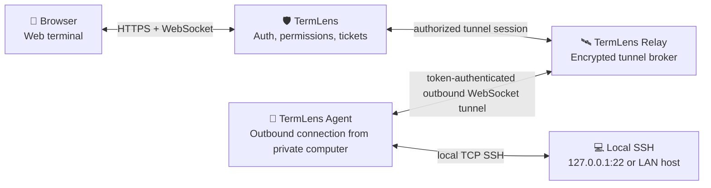
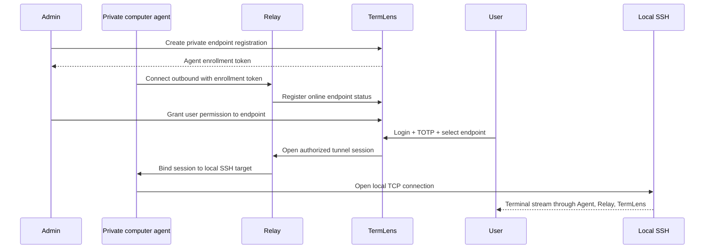

# Roadmap

[中文路线图](ROADMAP.zh-CN.md)

This roadmap tracks product-level optimizations that affect TermLens architecture or terminal usability.

## ✅ Mobile Terminal Experience

Status: implemented in the current main branch.

Mobile and tablet devices often lack terminal-friendly keys on the system keyboard. Soft keyboards can also cover the terminal viewport. TermLens addresses this with a RustDesk-style mobile terminal toolbar and viewport-aware layout.

Implemented improvements:

- 📱 Mobile-only terminal helper toolbar.
- ⌨️ One-shot `Ctrl`, `Alt`, `Shift`, and platform-aware `Cmd`/`Win` modifier keys that apply to the next helper key or system-keyboard input.
- 🎛️ Quick keys for `Esc`, `Tab`, `Enter`, `Backspace`, `Delete`, arrow keys, `Home`, `End`, `PgUp`, `PgDn`, `F1`-`F12`, and common `Ctrl` combinations.
- 🧰 Local helper-key customization for key profile, ordering, and visibility.
- 📝 Collapsible side text input panel for sending prepared text into the terminal cursor.
- ✍️ Vim helper keys for insert mode, command mode, save-and-quit, and force-quit.
- 🧭 Mobile terminal-first layout that auto-collapses side panels after connection.
- 🔣 Quick symbols for common shell input such as `|`, `~`, `/`, `-`, and `_`.
- 👆 Pointer handling that keeps terminal focus while tapping helper keys.
- 📐 `visualViewport`-aware terminal sizing to reduce soft-keyboard overlap.
- 🧾 Mobile terminal layout that can collapse the connection panel and reserve more space for the shell.

Future mobile improvements:

- Customizable helper-key rows.
- Long-press key variants.
- Paste confirmation for large clipboard content.
- Optional terminal zoom control for small screens.
- Better iPad split-screen layout.

## 🛰️ Private Endpoint Relay

Status: first implementation available behind the optional `TERMLENS_PRIVATE_RELAY_ENABLED` flag.

This item targets computers without a public IP address, such as a local laptop, desktop, homelab machine, or on-prem server behind NAT. The goal is to let an authorized user open a Web terminal from another network without exposing the local machine directly to the public internet.

### Recommended Architecture

TermLens does not ask the browser to connect directly to a private computer. Browsers cannot open SSH TCP connections, and a private machine behind NAT is not reachable from the public internet. The implemented design follows a RustDesk-like relay model:

### Interaction Flow

### Security Requirements

- 🔐 Agent enrollment tokens must be one-time or short-lived.
- 🧷 Agent identity is bound to a persistent Agent token after enrollment; key-pair or mTLS identity can be added as a hardening step.
- 🛰️ Relay must not grant access by itself; TermLens remains the policy authority.
- 🎟️ Every relay session must require a TermLens terminal ticket.
- 👥 Users need explicit permission for each private endpoint.
- 🕶️ SSH credentials must remain per-session and must not be persisted by Agent, Relay, or TermLens.
- 📜 Audit events should record endpoint online/offline state, session start, session end, and permission failures.
- 🚫 Relay should not expose arbitrary TCP forwarding by default; start with SSH-only forwarding.

### Implementation Phases

1. **Endpoint model** ✅
   - Add private endpoint records to TermLens.
   - Track owner, label, online status, last seen time, and allowed local target.

2. **TermLens Agent** ✅
   - Run on the private computer.
   - Establish outbound token-authenticated WebSocket connection to Relay.
   - Forward only approved local SSH TCP connections.

3. **Relay service** ✅
   - Broker encrypted tunnel sessions.
   - Avoid storing SSH credentials or terminal output.
   - Enforce session binding and backpressure.

4. **Admin console** ✅
   - Create endpoint enrollment tokens.
   - Show online/offline status.
   - Grant endpoint permissions to users.

5. **Terminal launch** ✅
   - Let users choose normal SSH targets or private relay endpoints.
   - Reuse TermLens login, TOTP, access links, target permissions, and terminal tickets.

6. **Hardening** Planned
   - Add rate limits, idle timeouts, endpoint revocation, agent token rotation, optional key-pair or mTLS identity, and deeper relay audit events.

### Non-goals

- No direct browser-to-private-computer TCP connection.
- No unauthenticated tunnel.
- No general-purpose arbitrary TCP proxy in the first version.
- No storage of terminal output or SSH credentials.
