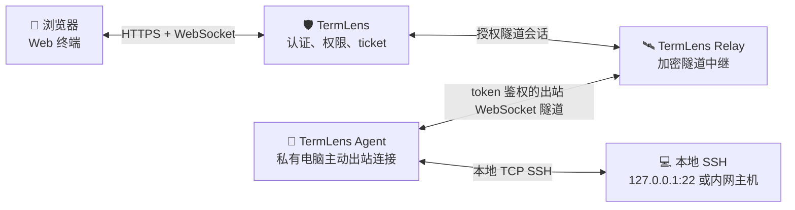
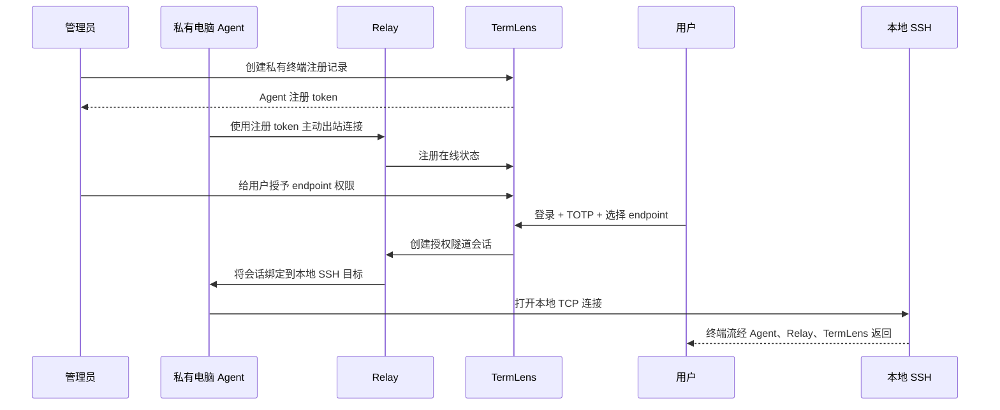

# 路线图

[English Roadmap](ROADMAP.md)

本路线图记录会影响 TermLens 架构或终端体验的产品级优化项。

## ✅ 移动端终端体验

状态：已在当前 main 分支实现。

手机和平板的系统键盘通常缺少终端常用按键，软键盘也容易遮挡终端视口。TermLens 通过参考 RustDesk 交互的移动端终端辅助按键栏和视口感知布局优化这个问题。

已实现优化：

- 📱 仅在移动端显示终端辅助按键栏。
- ⌨️ 支持一次性 `Ctrl`、`Alt`、`Shift` 和按系统类型显示的 `Cmd`/`Win` 修饰键，可作用到下一个辅助按键或系统键盘输入。
- 🎛️ 快捷输入 `Esc`、`Tab`、`Enter`、`Backspace`、`Delete`、方向键、`Home`、`End`、`PgUp`、`PgDn`、`F1`-`F12` 和常用 `Ctrl` 组合键。
- 🧰 支持在浏览器本地配置特殊键类型、排序和显隐。
- 📝 新增可折叠的右侧文本输入区，用于把预先输入的内容发送到终端光标位置。
- ✍️ 新增进入编辑、命令模式、保存退出、强制退出的 Vim 辅助键。
- 🧭 移动端采用终端优先布局，连接后自动收起辅助面板。
- 🔣 快捷输入 shell 常用符号，例如 `|`、`~`、`/`、`-` 和 `_`。
- 👆 点击辅助按键时尽量保持终端焦点。
- 📐 通过 `visualViewport` 感知软键盘后的可见视口高度，减少软键盘遮挡。
- 🧾 移动端终端布局支持折叠连接面板，为 shell 保留更多空间。

后续移动端优化：

- 支持自定义辅助按键行。
- 支持长按弹出按键变体。
- 粘贴大段剪贴板内容前增加确认。
- 增加小屏幕终端缩放控制。
- 优化 iPad 分屏布局。

## 🛰️ 私有终端中继

状态：首版已实现，可通过可选开关 `TERMLENS_PRIVATE_RELAY_ENABLED` 启用。

这个优化项面向没有公网 IP 的电脑，例如本地笔记本、台式机、家庭实验室机器或 NAT 后的内网服务器。目标是在异地通过 Web 终端访问本地电脑，同时不把本地电脑直接暴露到公网。

### 推荐架构

TermLens 不会让浏览器直接连接私有电脑。浏览器不能打开 SSH TCP 连接，NAT 后的私有电脑也无法被公网直接访问。当前实现采用类似 RustDesk 的中继模型：

### 交互流程

### 安全要求

- 🔐 Agent 注册 token 必须是一次性或短期有效。
- 🧷 Agent 完成注册后会绑定持久 Agent token；密钥对或 mTLS 身份可作为后续安全加固项。
- 🛰️ Relay 不能自己决定授权；TermLens 仍然是权限策略中心。
- 🎟️ 每次中继会话都必须要求 TermLens terminal ticket。
- 👥 用户必须显式拥有对应私有 endpoint 的访问权限。
- 🕶️ SSH 凭据只允许用于当前会话，Agent、Relay 和 TermLens 都不能持久化。
- 📜 审计事件需要记录 endpoint 上线/下线、会话开始、会话结束和权限失败。
- 🚫 Relay 默认不应该暴露任意 TCP 转发；第一版建议只支持 SSH 转发。

### 实现阶段

1. **Endpoint 模型** ✅
   - 在 TermLens 中新增私有 endpoint 记录。
   - 记录 owner、名称、在线状态、最后心跳时间和允许的本地目标。

2. **TermLens Agent** ✅
   - 运行在私有电脑上。
   - 主动通过 token 鉴权的 WebSocket 连接 Relay。
   - 只转发被允许的本地 SSH TCP 连接。

3. **Relay 服务** ✅
   - 负责加密隧道会话中继。
   - 不保存 SSH 凭据或终端输出。
   - 执行会话绑定和背压控制。

4. **管理后台** ✅
   - 创建 endpoint 注册 token。
   - 展示在线/离线状态。
   - 给用户授予 endpoint 权限。

5. **终端打开流程** ✅
   - 用户可以选择普通 SSH 目标或私有中继 endpoint。
   - 复用 TermLens 登录、TOTP、访问链接、目标权限和 terminal ticket。

6. **安全加固** 规划中
   - 增加限流、空闲超时、endpoint 吊销、Agent token 轮换、可选密钥对或 mTLS 身份和更深入的 Relay 审计事件。

7. **平滑重启和连接排空** 规划中
   - 部署时尽量保持已建立的私有中继、终端 WebSocket 和 SSH 会话不断开。
   - 进入关闭流程后停止签发新的中继终端 ticket，同时允许已建立会话继续排空。
   - 增加关闭钩子，优先关闭空闲 relay 连接，等待活跃 stream 结束，并设置最大排空等待时间。
   - 在 relay 连接状态支持跨进程共享前，补充单后端或 WebSocket 粘性路由的部署要求。

### 非目标

- 不做浏览器到私有电脑的直接 TCP 连接。
- 不做未鉴权隧道。
- 第一版不做通用任意 TCP 代理。
- 不保存终端输出或 SSH 凭据。
